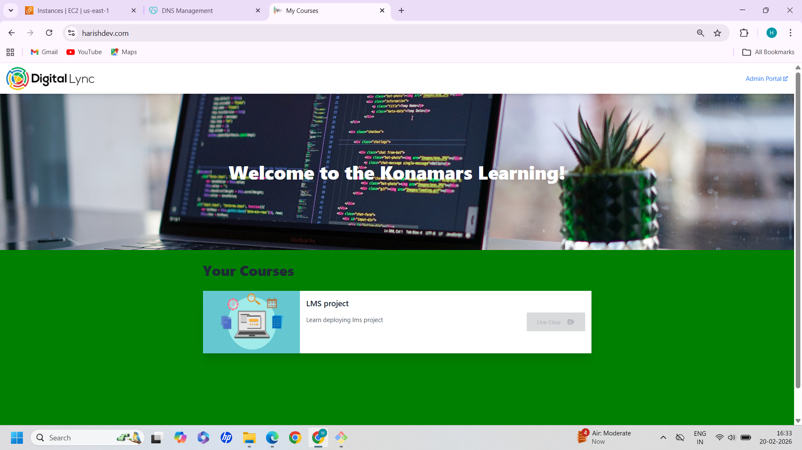

# Konamars LMS

## App environments

| Environment                                                               | Git Branch |
| ------------------------------------------------------------------------- | ---------- |
| [production](https://calm-pebble-0c3131110.1.azurestaticapps.net/)        | main       |
| [dev](https://calm-pebble-0c3131110-dev.centralus.1.azurestaticapps.net/) | dev        |
| [qa](https://calm-pebble-0c3131110-dev.centralus.1.azurestaticapps.net/)  | qa         |

## Run project locally

- Install node modules with `npm install`
- Run local dev server with `npm dev`

## Run in production

- Install node modules with `npm install`
- Build with `npm build`
- Serve generated `dist/` folder with a production web server

_View the deployment resource in azure cloud portal at [here.](https://portal.azure.com/#@mkonakonamars.onmicrosoft.com/resource/subscriptions/d5f3450e-23c9-47f0-a07c-f650dee64c3c/resourcegroups/javascript-stack/providers/Microsoft.Web/staticSites/konamars/staticsite)_
=======
# LMS Full Stack Application

## Project Overview
This is a Full Stack Learning Management System (LMS) application deployed on AWS EC2 using Nginx and HTTPS.

##  Tech Stack
- Frontend: React + Vite
- Backend: Node.js + Express
- Server: AWS EC2 (Ubuntu)
- Web Server: Nginx
- SSL: Let's Encrypt (Certbot)
- Version Control: Git & GitHub

## Live Application
https://harishdev.com

## Deployment Steps
1. Setup EC2 instance
2. Install Node.js and Nginx
3. Configure reverse proxy
4. Setup SSL using Certbot
5. Configure environment variables
6. Build frontend
7. Deploy backend service

## Key Features
- HTTPS enabled
- Reverse proxy configuration
- Production build deployment
- Environment variable configuration
- GitHub version control


## 🏗 Architecture Diagram


## 🚀 Deployment Steps (EC2 Manual Deployment)

### 1️⃣ Launch EC2 Instance
- Ubuntu 22.04
- Open ports: 22, 80, 443

### 2️⃣ Install Dependencies

```bash
sudo apt update
sudo apt install nginx -y
sudo apt install nodejs npm -y

3️⃣ Clone Repository
git clone https://github.com/your-username/lms-fullstack-aws-deployment.git
cd lms-fullstack-aws-deployment

4️⃣ Start Backend
cd api
npm install
npm start

5️⃣ Configure Nginx Reverse Proxy
Proxy from port 80/443
Backend running on port 8080
6️⃣ Enable HTTPS (Certbot)
sudo apt install certbot python3-certbot-nginx
sudo certbot --nginx -d yourdomain.com


## 📸 Application Screenshot




## Author
Harish Pasupunuti

